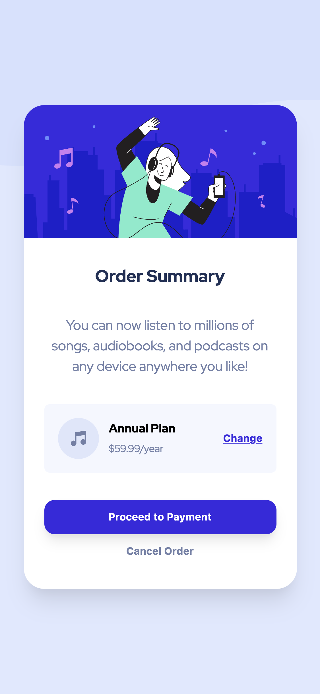

# Frontend Mentor - Order summary card solution

This is a solution to the [Order summary card challenge on Frontend Mentor](https://www.frontendmentor.io/challenges/order-summary-component-QlPmajDUj). Frontend Mentor challenges help you improve your coding skills by building realistic projects. 

## Table of contents

- [Overview](#overview)
  - [The challenge](#the-challenge)
  - [Screenshot](#screenshot)
  - [Links](#links)
- [My process](#my-process)
  - [Built with](#built-with)
  - [Useful resources](#useful-resources)
- [Author](#author)
- [Acknowledgments](#acknowledgments)

**Note: Delete this note and update the table of contents based on what sections you keep.**

## Overview

### The challenge

Users should be able to:

- See hover states for interactive elements

### Screenshot

### Links

- Solution URL: [Github](https://github.com/thaisdelima/frontend-mentor-order-summary-card-solution)
- Live Site URL: [Live in Vercel](https://frontend-mentor-order-summary-card-solution-nine.vercel.app/)

## My process

### Built with

- Semantic HTML5 markup
- Mobile-first workflow
- [React](https://reactjs.org/) - JS library
- [Next.js](https://nextjs.org/) - React framework
- [TailWindCSS](https://tailwindcss.com) - For styles

### What I learned

For this project I used TailWindCSS to learn the basics and configurations of this CSS framework.

### Useful resources

- [TailWindCSS - Active state](https://tailwindcss.com/docs/hover-focus-and-other-states#default-variants-reference) - This specific doc section  helped me with configuration of active status. The active css utility is by default unactivated, so the configuration file must be adjust to use this utility.

## Author

- Website - [Thaís de Lima](http://www.thais.dev.br/)
- Frontend Mentor - [@thaisdelima](https://www.frontendmentor.io/profile/thaisdelima)
- Twitter - [@thaisdelima](https://www.twitter.com/thaisdelima)

